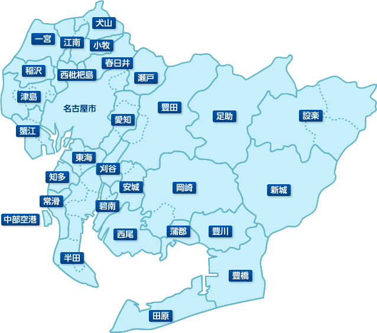

### システム2部会議（発表者：長谷川徹）

---

### 自己紹介

+++

5月入社 長谷川 徹

+++

年齢：1988年10月8日生まれ（今年32歳）

+++

出身地：愛知県小牧市

+++

部活、サークル：野球（小学）、テニス（中学・高校）、軽音楽（大学）

+++

趣味：音楽鑑賞（ロック）、スポーツ観戦（スポーツ全般好きですが、特に野球）

---

### 出身地について

+++

出身地：愛知県小牧市

+++

+++

## 方言（僕がほんとよく使ってました）

+++

<strong>でら</strong>

+++

<strong>机をつる</strong>

+++

<strong>けった</strong>

---

### 職務経歴

+++

愛知県名古屋市のWeb制作会社で7年ほどエンジニアとして勤務
フロントエンドとバックエンドとクライアントとの均衡
浅く幅広く業務に携わっていました

+++

何故マイナビ（東京）に？

---

### ご静聴ありがとうございました
